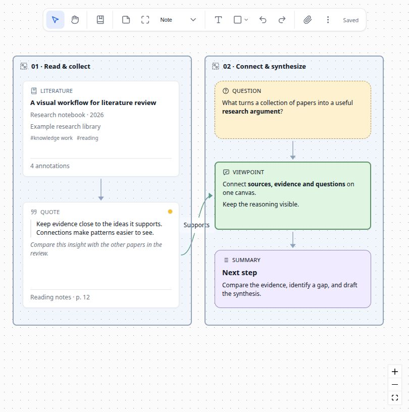
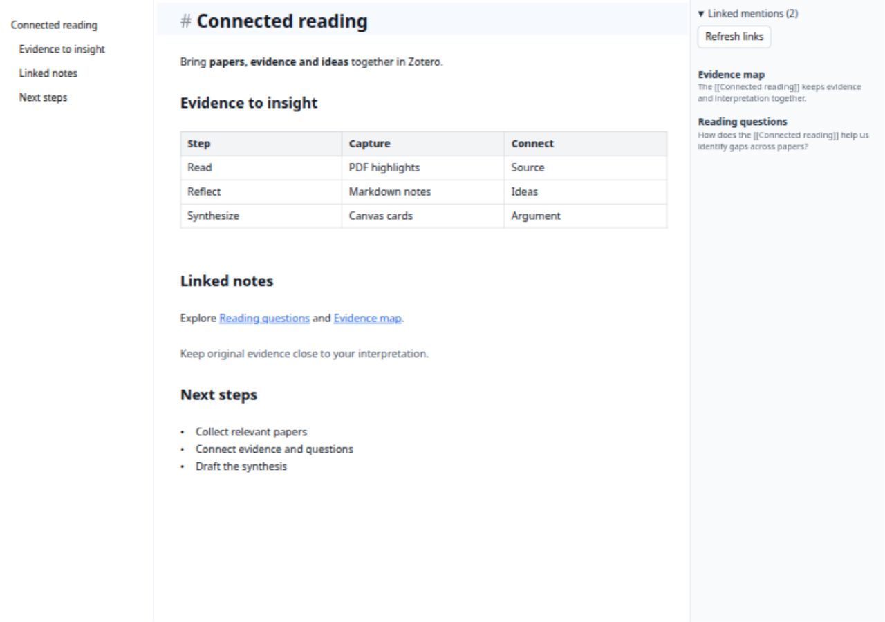
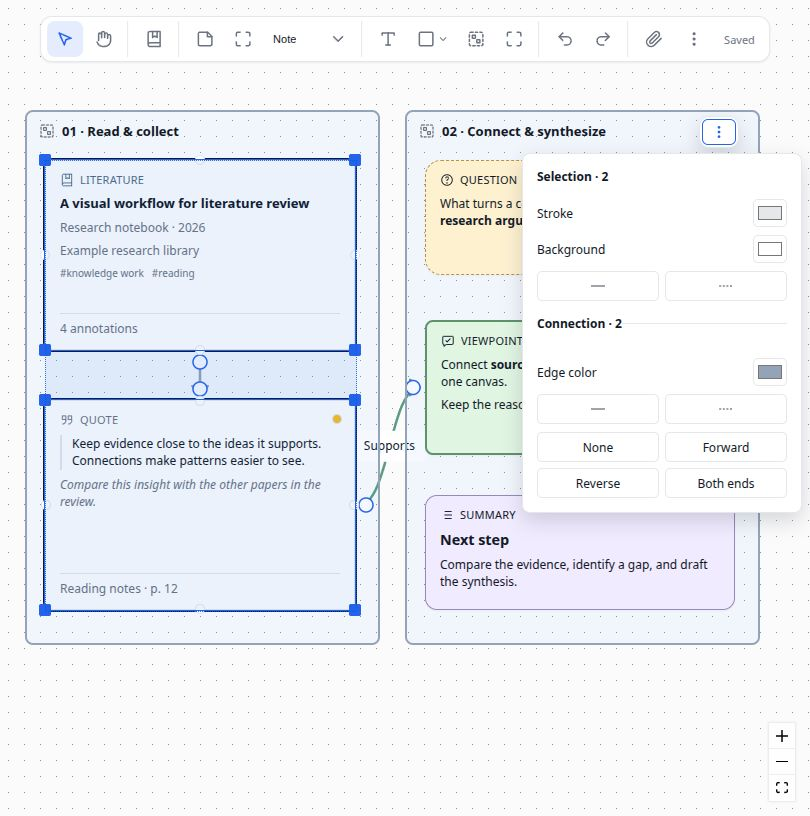

<p align="center">
  
</p>

<h1 align="center">Scholar Sketch</h1>

<p align="center"><strong>Markdown &amp; Whiteboard for Zotero</strong></p>

<p align="center">
  <a href="https://www.zotero.org"></a>
  <a href="https://github.com/l0o0/scholar-sketch/releases"></a>
  <a href="./LICENSE"></a>
</p>

Scholar Sketch extends Zotero with Markdown notes and visual whiteboards, connecting papers, PDF annotations, and ideas in one workspace.

[English](README.md) | [简体中文](doc/README-zhCN.md) · [Download](https://github.com/l0o0/scholar-sketch/releases/latest)

## Features

- **Markdown editing**: Live preview, source editing, and reading preview, with tables, images, math, and footnotes.
- **Linked notes**: `[[Note]]` links, an outline, backlinks, and library-wide full-text search.
- **Research whiteboards**: organize papers, annotations, notes, and attachments with groups, connections, batch styling, and auto layout.
- **Zotero integration**: drag papers onto a board, browse PDF annotations, or turn text annotations into Markdown notes.
- **Portable files**: native `.md` and JSON Canvas `.canvas` files; export notes with images for Obsidian and other tools, or boards as PNG, SVG, and Markdown.
- **Saving and recovery**: autosave, local history, and file conflict checks, with tabs and standalone windows.

## Install

Requires **Zotero 9 / 10 for desktop**.

1. Download `scholarsketch-v{version}.xpi` from [Releases](https://github.com/l0o0/scholar-sketch/releases/latest).
2. In Zotero, open **Tools → Plugins → gear → Install Plugin From File…** and select the downloaded file.

## Screenshots

**Connect papers, annotations, and ideas on a research whiteboard.**



**Write Markdown with live preview and linked mentions.**



<details>
<summary>Batch styling for cards and connections</summary>



</details>

## Quick start

- **Write a note**: right-click a paper → **New Markdown…**. Double-click its `.md` attachment to continue editing. Type `[[` to link another note.
- **Create a whiteboard**: choose **Tools → New Whiteboard…**, drag in papers, and connect cards. Hold **Space** and drag to pan.
- **Explore an example**: choose **Help → Scholar Sketch: Create Example Whiteboard**.

Stored attachments follow Zotero file sync; linked attachments need separate syncing. Local history stays on the current device.

## Documentation

- [Links and export](docs/obsidian-links.md)
- [Saving and recovery](docs/file-safety.md) (Chinese)
- [Feature guide](docs/markdown-canvas-release-features.md) (Chinese)

<details>
<summary>Development and plugin integration</summary>

```bash
pnpm install
cp .env.example .env  # Configure your Zotero development environment
pnpm start           # Build and launch Zotero
pnpm run build       # Build the XPI
```

[Browser testing](docs/fake-zotero.md) · [Markdown API](docs/markdown-api.md) · [Canvas API](docs/canvas-api.md)

</details>

Feedback and contributions are welcome through [Issues](https://github.com/l0o0/scholar-sketch/issues) and pull requests.

Built with [Zotero Plugin Template](https://github.com/windingwind/zotero-plugin-template) and [markdown-it](https://github.com/markdown-it/markdown-it).

[AGPL-3.0-or-later](LICENSE)
